Retro Programming Works For 8086 PC 怀旧编程作品（8086 PC用）
=============================================================

被模拟的PC Emulated PC
----------------------

### 年代 Era

* 1990 ~ 1992

### 配置 Configuration

* CPU: V20 (80186 Compatible)
* RAM: 640k
* Floppy Drive A: 5.25" 1.2M High Density 
* Floppy Drive B: 5.25" 360k Double Side 
* Display: CGA with green monochrome monitor

主要用途 Main Usage
-------------------

* BASIC编程 BASIC Programming
* WPS中英文文字处理 WPS Chinese & English Text Processing
* 俄罗斯方块游戏 Tetris game
* 2048游戏 2048 Game
* 黑白棋游戏 Reversi Game
* 英文打字练习 English Typing Training
* 五笔打字练习 Wubi Input Training

截图欣赏 Screenshots
--------------------

2048游戏 2048 Game  
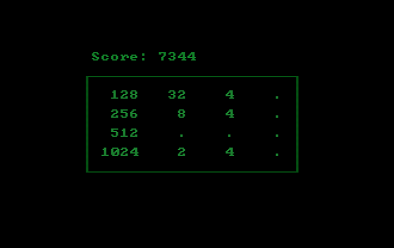

俄罗斯方块 Tetris  
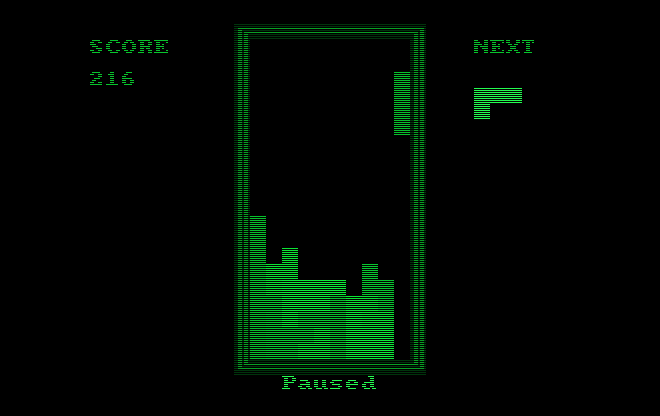

猜数字游戏 Bulls and Cows  
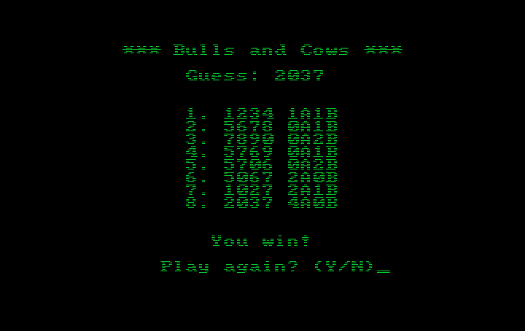

九九乘法表 9x9 Multiplication Table  
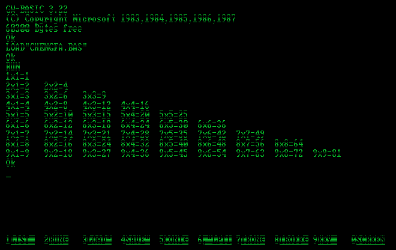

求1000以内的质数 Get prime numbers under 1000  
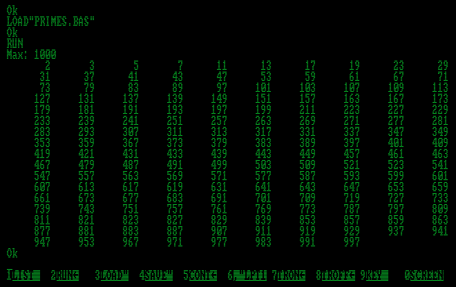

斐波那契数列 Fibonacci Sequence  
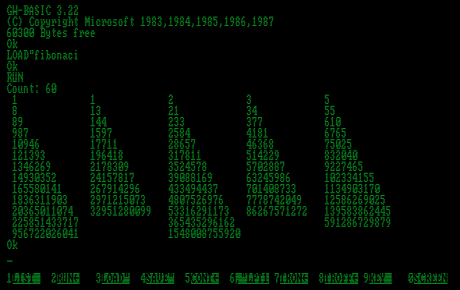

显示杨辉三角 Display Yanghui Triangle  
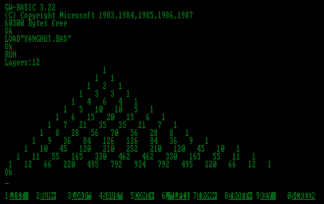

条形图 Bar Chart  

饼图 Pie Chart  
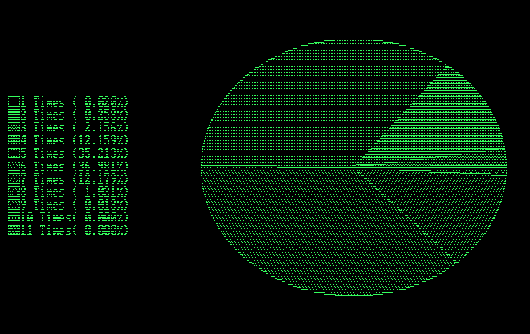

绘制几何形状 Drawing Geometric Shapes  
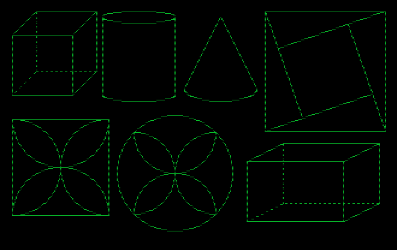

屏保 Screensaver  

谢尔宾斯基地毯 Sierpinski Carpet  
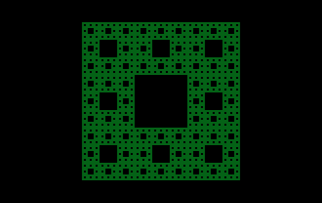

数独求解程序 Sudoku Solver  
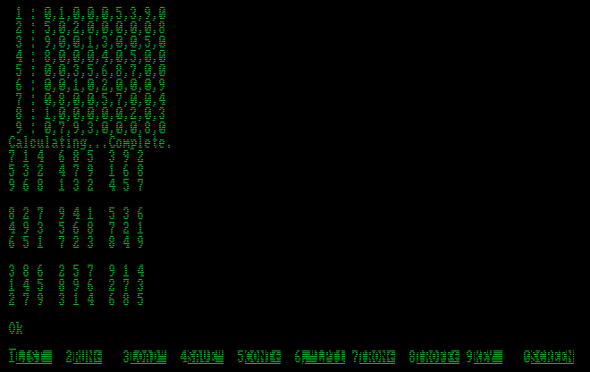

显示古诗 Poem Showing  
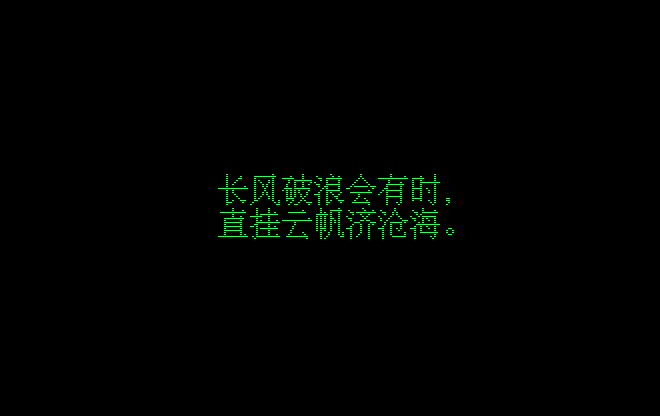

显示古诗（使用BSAVE图像数据） Poem Showing (Using BSAVE Image Data)  
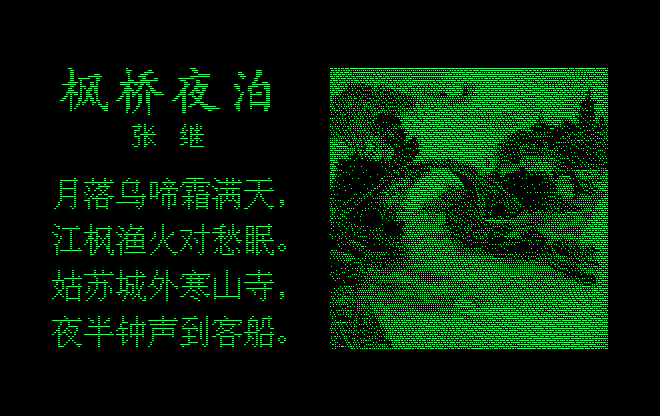

新年快乐 Happy New Year  
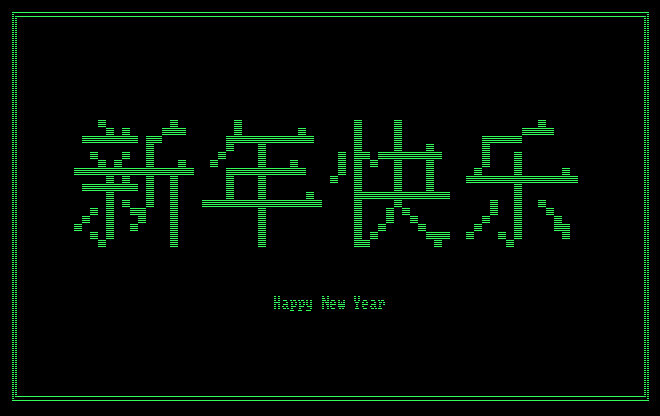

诸事皆顺 Everything Goes Well  
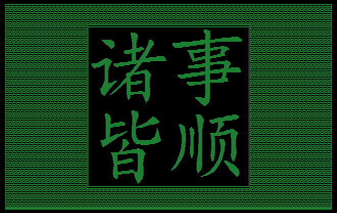

月亮河 *Moon River*  

繁花曲线 Flower Curves  

图案 Patterns  
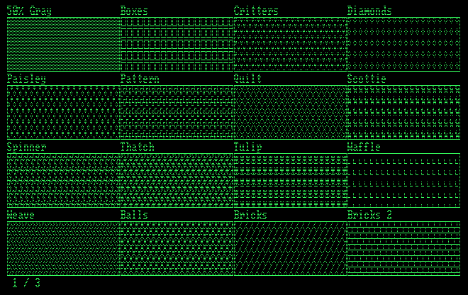  
  
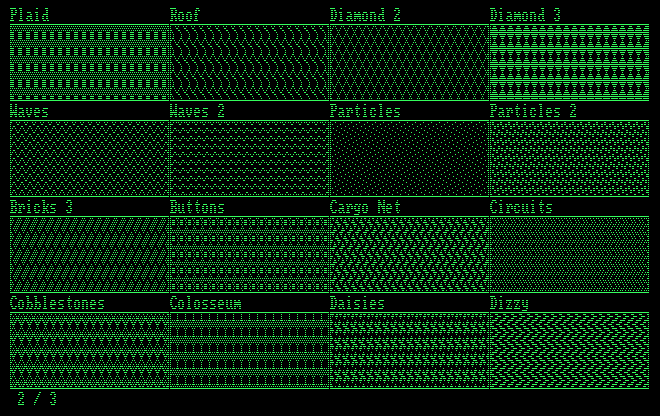  
  
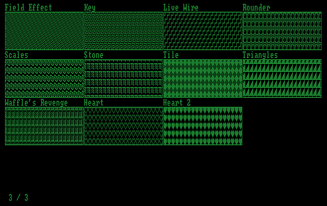

中文数字 Chinese Number  
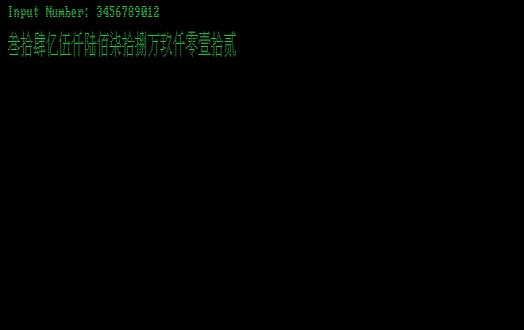

罗马数字 Roman Number  
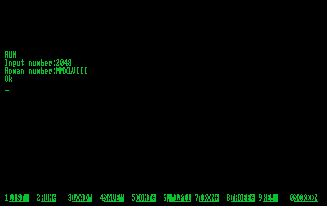

24点求解器 24 Game Solver  
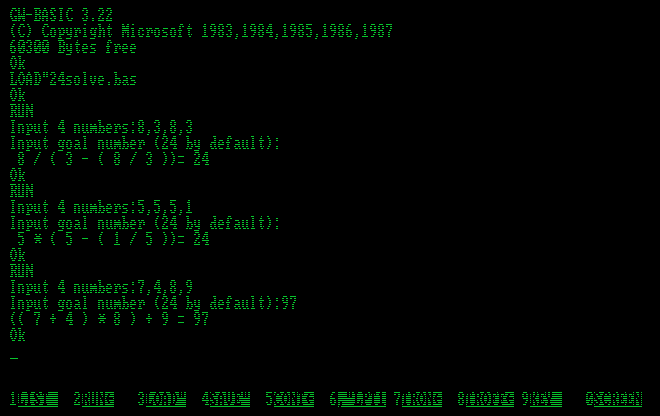

猜数字求解器 Bulls and Cows Solver  
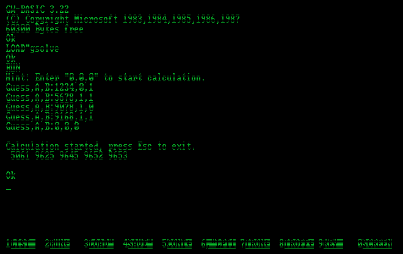

